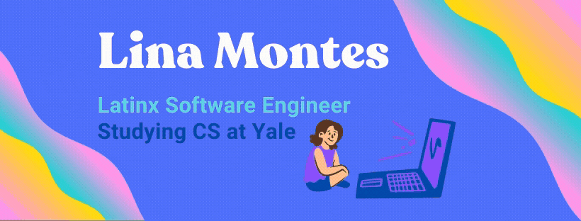

# Hi! I'm Lina 👩🏼‍💻🇨🇴🌎🌖✨🌈🗽💖💜💙

I'm a first-generation, non-binary Latinx software engineer currently in my junior year at Yale. My converging identities have fueled my interest in the intersection of technology and activism in order to change my community and world. Technology is a pathway for me to bring my ideas to life.
 

🔭 I’m currently working at Google as a STEP intern

🌱 I’m currently learning ASL, Portuguese, and Egyptian Hieroglyphics

🦦 Pronouns: They/Them

⚡ Fun fact: One time, I got lost on a mountain while hiking in Antigua ⛰

## Find me on the web 🌎
- Sharing updates on <a href="https://www.linkedin.com/in/lina-montes">LinkedIn</a> 💼
